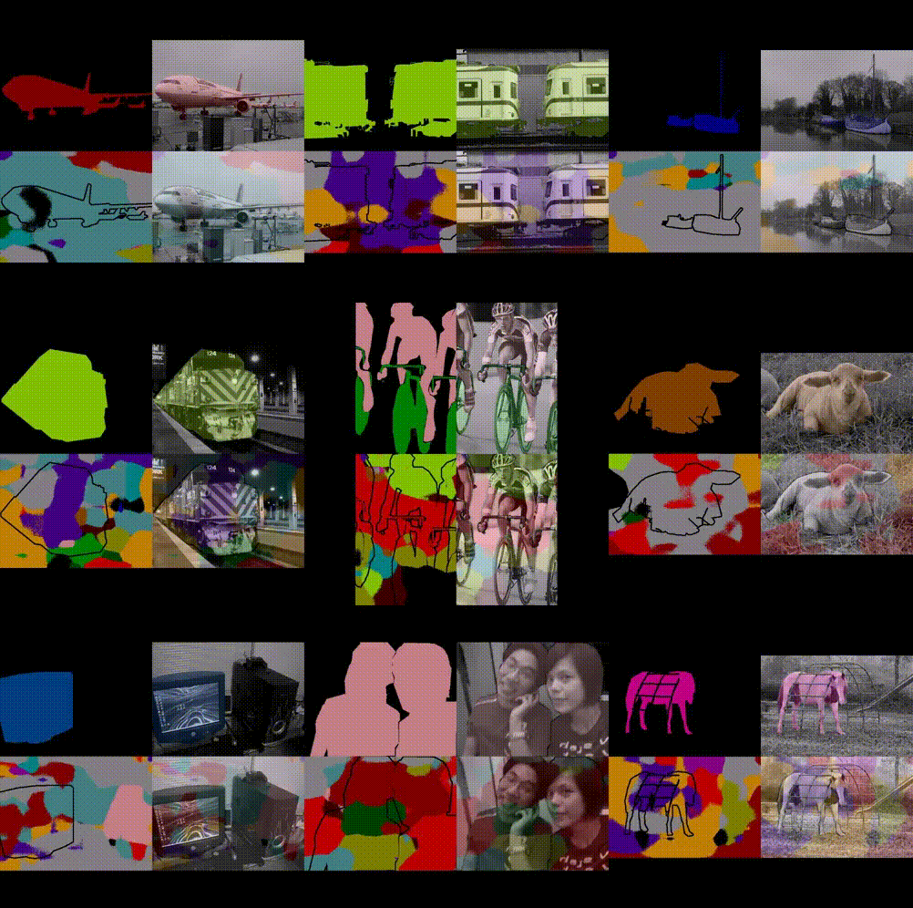
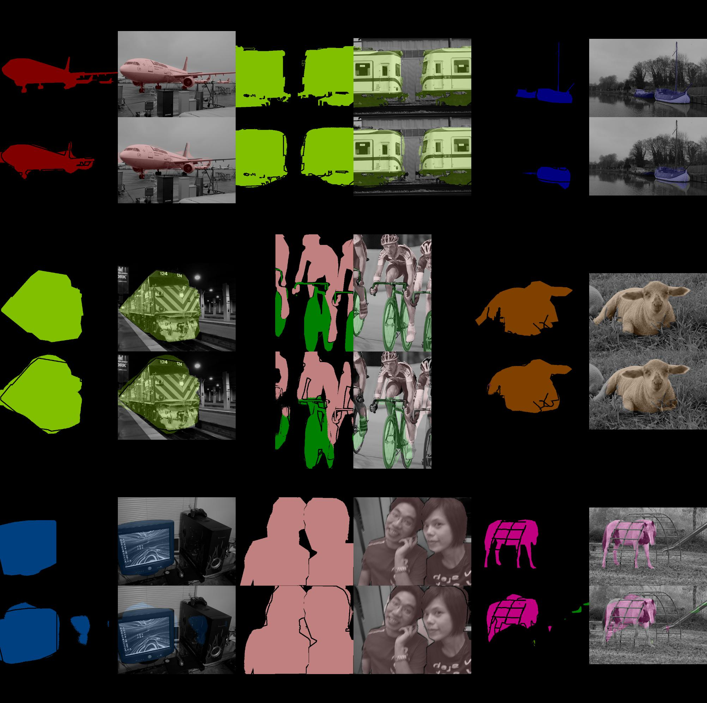

fcn - Fully Convolutional Networks
==================================

[](https://badge.fury.io/gh/wkentaro%2Ffcn)
[](https://travis-ci.org/wkentaro/fcn)

This is [Chainer](https://github.com/pfnet/chainer.git) implementation of
[fcnbberkeleyvisionoorg](https://github.com/shelhamer/fcn.berkeleyvision.org.git).

Features
--------

- Copy caffemodel to chainermodel.  [[v1.0.0](https://github.com/wkentaro/fcn/releases/tag/v1.0.0)]
- Forwarding with Chainer for pascal dataset.  [[v1.0.0](https://github.com/wkentaro/fcn/releases/tag/v1.0.0)]
- Training with Chainer for pascal dataset.  [[v2.0.0](https://github.com/wkentaro/fcn/releases/tag/v2.0.0)]
- Training for APC2015 dataset.  [[v3.0.0](https://github.com/wkentaro/fcn/releases/tag/v3.0.0)]

License
-------

Copyright (C) 2016 Kentaro Wada\
Released under the MIT license\
<http://opensource.org/licenses/mit-license.php>

Installation
------------

```bash
# Ubuntu: install required libraries via apt
sudo apt-get install liblapack-dev   # for numpy
sudo apt-get install libhdf5-dev     # for h5py
# macOS: install required libraries via brew
brew install gfortran  # for numpy
brew install hdf5      # for h5py

pip install fcn
```

Inference
---------

Inference is done as below:

```bash
# Download sample image
wget https://farm2.staticflickr.com/1522/26471792680_a485afb024_z_d.jpg -O sample.jpg

# forwaring of the networks
fcn_infer.py --img-files sample.jpg --gpu -1  # cpu mode
fcn_infer.py --img-files sample.jpg  # gpu mode
```


Original Image: <https://www.flickr.com/photos/faceme/26471792680/>

Training
--------

```bash
cd examples/pascal
./download_dataset.py

./train_fcn32s.py --gpu 0
```

The accuracy of original implementation is computed with (`validate.py`) after converting the caffe model to chainer one
using `convert_caffe_to_chainermodel.py`.

| Implementation | Accuracy | Accuracy Class | Mean IU | FWAVACC |
|:--------------:|:--------:|:--------------:|:-------:|:-------:|
| [Original](https://github.com/shelhamer/fcn.berkeleyvision.org/tree/master/voc-fcn32s) | 90.48 | 76.48 | 63.62 | 83.45 |
| Ours | **90.74** | **75.84** | **63.76** | **83.73** |

 
