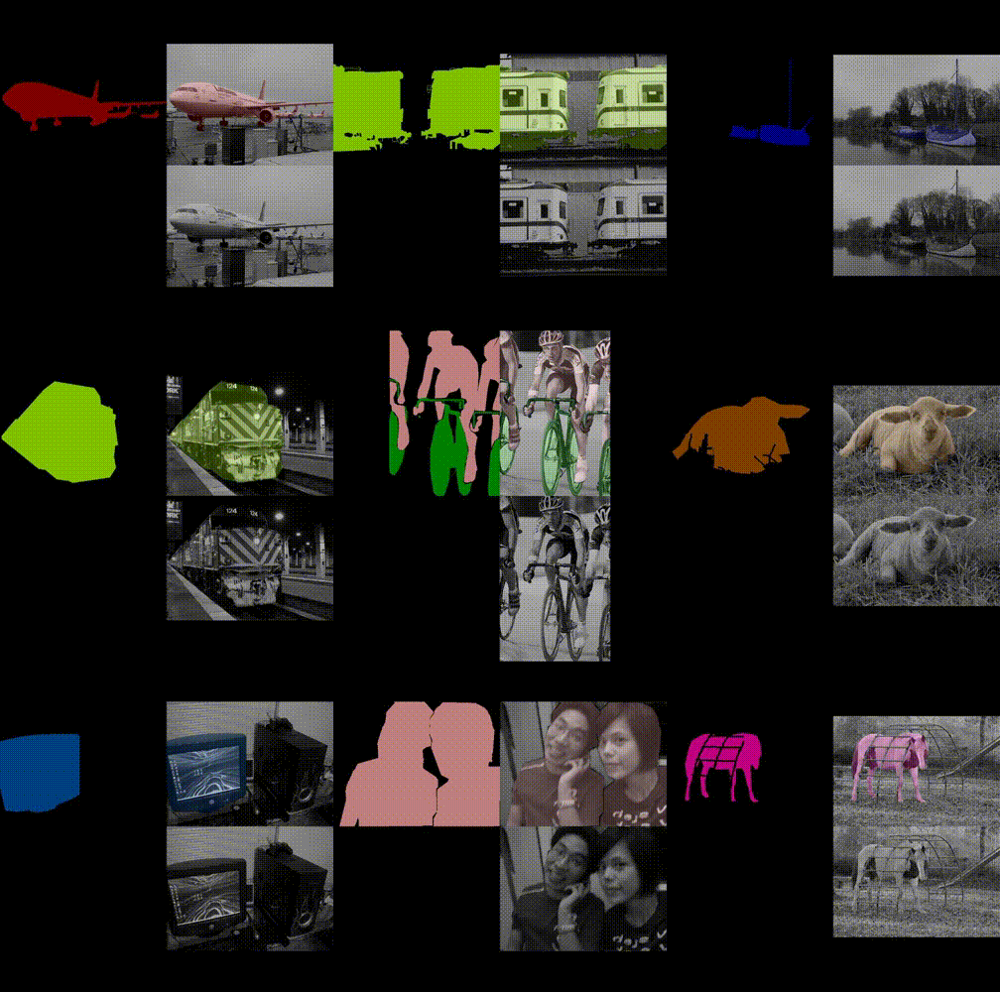
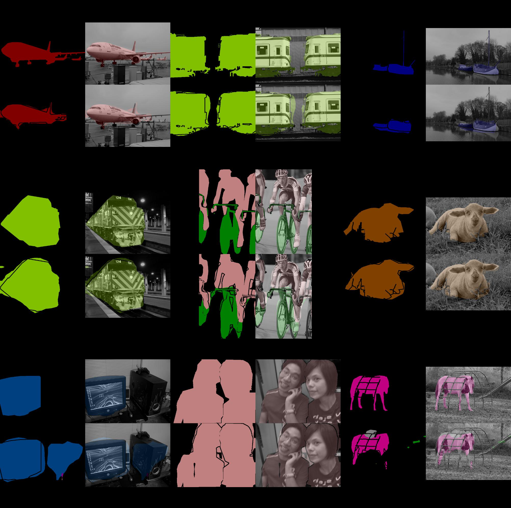

fcn - Fully Convolutional Networks
==================================

[](https://badge.fury.io/gh/wkentaro%2Ffcn)
[](https://travis-ci.org/wkentaro/fcn)

This is [Chainer](https://github.com/pfnet/chainer.git) implementation of
[fcn.berkeley.vision.org](https://github.com/shelhamer/fcn.berkeleyvision.org.git).


Installation
------------

```bash
pip install --upgrade setuptools

pip install fcn
```


Inference
---------

Inference is done as below:

```bash
# Download sample image
wget https://farm2.staticflickr.com/1522/26471792680_a485afb024_z_d.jpg -O sample.jpg

# forwaring of the networks
fcn_infer.py --img-files sample.jpg --gpu -1  # cpu mode
fcn_infer.py --img-files sample.jpg  # gpu mode
```


Original Image: <https://www.flickr.com/photos/faceme/26471792680/>


Training
--------

```bash
cd examples/voc
./download_dataset.py

./train_fcn32s.py --gpu 0
# ./train_fcn16s.py --gpu 0
# ./train_fcn8s.py --gpu 0
# ./train_fcn8s_atonce.py --gpu 0
```

The accuracy of original implementation is computed with (`evaluate.py`) after converting the caffe model to chainer one
using `convert_caffe_to_chainermodel.py`.

**FCN32s**

| Implementation | Accuracy | Accuracy Class | Mean IU | FWAVACC |
|:--------------:|:--------:|:--------------:|:-------:|:-------:|
| [Original](https://github.com/shelhamer/fcn.berkeleyvision.org/tree/master/voc-fcn32s) | 90.4810 | 76.4824 | 63.6261 | 83.4580 |
| Ours (using `vgg16_from_caffe.npz`) | **90.5668** | **76.8740** | **63.8180** | **83.5067** |

 

**FCN16s**

| Implementation | Accuracy | Accuracy Class | Mean IU | FWAVACC |
|:--------------:|:--------:|:--------------:|:-------:|:-------:|
| [Original](https://github.com/shelhamer/fcn.berkeleyvision.org/tree/master/voc-fcn16s) | 90.9971 | **78.0710** | 65.0050 | 84.2614 |
| Ours (using `fcn32s_from_caffe.npz`) | 90.9671 | 78.0617 | 65.0911 | 84.2604 |
| Ours (using `fcn32s_iter00092000.npz`) | **91.1009** | 77.2522 | **65.3628** | **84.3675** |

**FCN8s**

| Implementation | Accuracy | Accuracy Class | Mean IU | FWAVACC |
|:--------------:|:--------:|:--------------:|:-------:|:-------:|
| [Original](https://github.com/shelhamer/fcn.berkeleyvision.org/tree/master/voc-fcn8s) | 91.2212 | **77.6146** | **65.5126** | 84.5445 |
| Ours (using `fcn16s_from_caffe.npz`) | **91.2513** | 77.1490 | 65.4789 | **84.5460** |

**FCN8sAtOnce**

| Implementation | Accuracy | Accuracy Class | Mean IU | FWAVACC |
|:--------------:|:--------:|:--------------:|:-------:|:-------:|
| [Original](https://github.com/shelhamer/fcn.berkeleyvision.org/tree/master/voc-fcn8s-atonce) | **91.1288** | **78.4979** | **65.3998** | **84.4326** |
| Ours (using `vgg16_from_caffe.npz`) | 91.0883 | 77.3528 | 65.3433 | 84.4276 |
