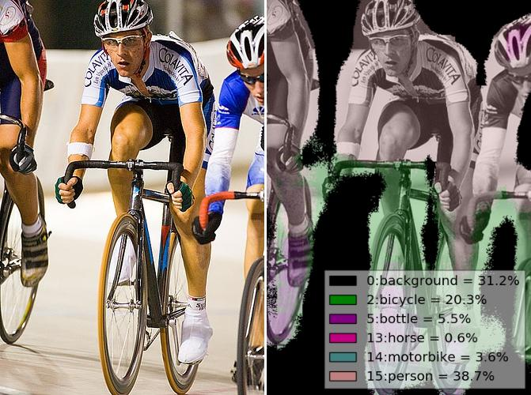

fcn - Fully Convolutional Networks
==================================

.. image:: https://badge.fury.io/gh/wkentaro%2Ffcn.svg
    :target: https://badge.fury.io/gh/wkentaro%2Ffcn
.. image:: https://travis-ci.org/wkentaro/fcn.svg?branch=master
    :target: https://travis-ci.org/wkentaro/fcn

This is Chainer_ implementation of fcn.berkeleyvision.org_.

.. _fcn.berkeleyvision.org: https://github.com/shelhamer/fcn.berkeleyvision.org.git
.. _Chainer: https://github.com/pfnet/chainer.git

Features
--------

- Provide FCN8s model for Chainer. [v1.0.0_]
- Copy caffemodel to chainermodel. [v1.0.0_]
- Forwarding with Chainer for pascal dataset. [v1.0.0_]
- Training with Chainer for pascal dataset. [v2.0.0_]
- Training for APC2015 dataset. [v3.0.0_]

.. _v1.0.0: https://github.com/wkentaro/fcn/releases/tag/v1.0.0
.. _v2.0.0: https://github.com/wkentaro/fcn/releases/tag/v2.0.0
.. _v3.0.0: https://github.com/wkentaro/fcn/releases/tag/v3.0.0

License
-------
| Copyright (C) 2016 Kentaro Wada
| Released under the MIT license
| http://opensource.org/licenses/mit-license.php

Installation
------------

.. code-block:: bash

  # Ubuntu: install required libraries via apt
  sudo apt-get install liblapack-dev   # for numpy
  sudo apt-get install libhdf5-dev     # for h5py
  # macOS: install required libraries via brew
  brew install gfortran  # for numpy
  brew install hdf5      # for h5py

  pip install fcn

For Inference
+++++++++++++

Inference is done as below:

.. code-block:: bash

  # Download sample image
  wget https://farm2.staticflickr.com/1522/26471792680_a485afb024_z_d.jpg -O sample.jpg

  # forwaring of the networks
  fcn_infer.py --img-files sample.jpg --gpu -1  # cpu mode
  fcn_infer.py --img-files sample.jpg  # gpu mode

.. image:: static/fcn8s_26471792680.jpg

Original Image: https://www.flickr.com/photos/faceme/26471792680/

For Developing
++++++++++++++

.. code-block:: bash

  git clone https://github.com/wkentaro/fcn.git
  cd fcn

  python setup.py develop

Training
--------

.. code-block:: bash

  cd examples/pascal
  ./download_dataset.py

  ./train_fcn32s.py

Currently we support only training FCN32s.
The learning curve looks like below:

.. image:: static/fcn32s_learning_curve.png

Inference with FCN32s + 60000 iterations outputs below result:

