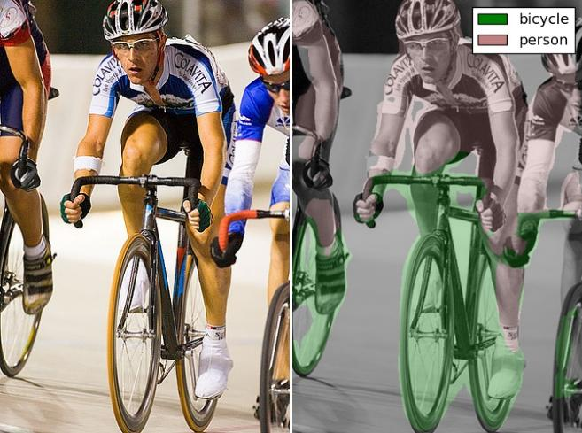

fcn - Fully Convolutional Networks
==================================

This is Chainer_ implementation of fcn.berkeleyvision.org_.

.. _fcn.berkeleyvision.org: https://github.com/shelhamer/fcn.berkeleyvision.org.git
.. _Chainer: https://github.com/pfnet/chainer.git

Features
--------

- Provide FCN8s model for Chainer. [done]
- Copy caffemodel to chainermodel. [done]
- Forwarding with Chainer for pascal dataset. [done]
- Training with chainer. [not yet]

Installation
------------

.. code-block:: bash

  git clone https://github.com/wkentaro/fcn.git
  cd fcn

  # This downloads caffemodel and convert it to chainermodel
  ./scripts/caffe_to_chainermodel.py

Usage
-----

.. code-block:: bash

  ./scripts/forward.py

**Result**

(http://host.robots.ox.ac.uk/pascal/VOC/voc2012/)

License
-------
| Copyright (C) 2016 Kentaro Wada
| Released under the MIT license
| http://opensource.org/licenses/mit-license.php
