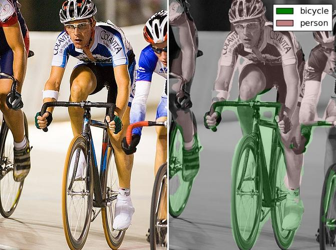

FCN - Fully Convolutional Networks
==================================

Installation
------------

.. code-block:: bash

  git clone https://github.com/wkentaro/FCN.git
  cd FCN

  # This downloads caffemodel and convert it to chainermodel
  ./scripts/caffe_to_chainermodel.py

Usage
-----

.. code-block:: bash

  ./scripts/forward.py

**Result**

License
-------
| Copyright (C) 2016 Kentaro Wada
| Released under the MIT license
| http://opensource.org/licenses/mit-license.php
